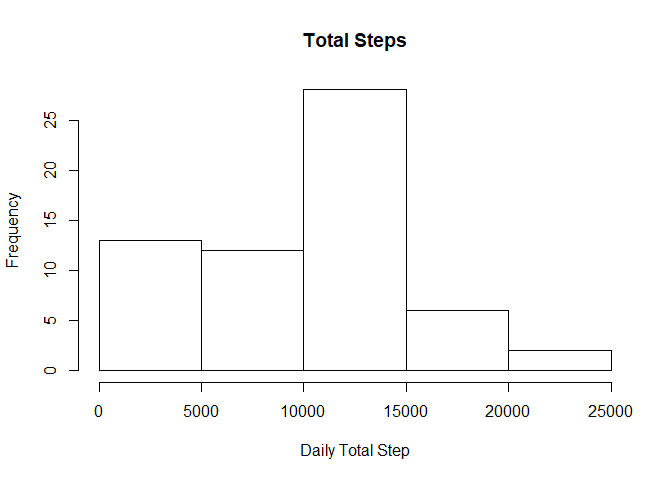
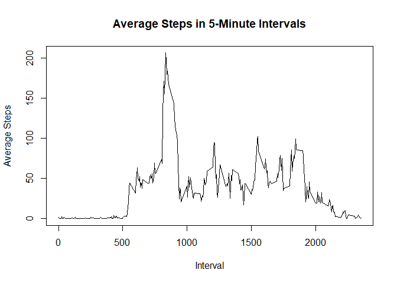

# Reproducible Research: Peer Assessment 1


## Loading and preprocessing the data

1. Load the data (i.e. read.csv())

```r
ActivityRaw <- read.csv("activity.csv")
```

Process/transform the data (if necessary) into a format suitable for your analysis

```r
## Convert date column
ActivityRaw$date <- as.Date(ActivityRaw$date)
```


## What is mean total number of steps taken per day?

1. Calculate the total number of steps taken per day

```r
DailyStepTotal <- aggregate(ActivityRaw$steps, list(ActivityRaw$date), FUN = sum, na.rm=TRUE)
colnames(DailyStepTotal) <- c("Date", "Total Steps")
```

2. Create a histogram of the total number of steps

```r
hist(DailyStepTotal$`Total Steps`, main = "Total Steps", xlab = "Daily Total Step")
```

<!-- -->

3. Calculate Mean and Median of the number of steps per day

```r
## Mean
mean(DailyStepTotal$`Total Steps`)
```

```
## [1] 9354.23
```

```r
## Median
median(DailyStepTotal$`Total Steps`)
```

```
## [1] 10395
```
Mean is 9354.23 and Median is 10395

## What is the average daily activity pattern?

1. Make a time series plot (i.e. type = "l") of the 5-minute interval (x-axis) and the average number of steps taken, averaged across all days (y-axis)

Create table containing average steps data

```r
## Aggregate Data
FiveMinuteStep <- aggregate(ActivityRaw$steps, by = list(ActivityRaw$interval), FUN = mean, na.rm = TRUE)

## Revise Column Names
colnames(FiveMinuteStep) <- c("Interval", "Average.Step")
```

Plot Data

```r
plot(FiveMinuteStep$Interval, FiveMinuteStep$Average.Step, type = "l", main = "Average Steps in 5-Minute Intervals", xlab = "Interval", ylab = "Average Steps")
```

<!-- -->

2. Which 5-minute interval, on average across all the days in the dataset, contains the maximum number of steps?

Find interval with highest number of steps

```r
FiveMinuteStep[which.max(FiveMinuteStep$Average.Step),1]
```

```
## [1] 835
```
Interval 835

## Imputing missing values

1. Calculate and report the total number of missing values in the dataset (i.e. the total number of rows with NAs)

Calculate number of rows with NAs

```r
sum(is.na(ActivityRaw))
```

```
## [1] 2304
```
2304

2. Devise a strategy for filling in all of the missing values in the dataset. The strategy does not need to be sophisticated. For example, you could use the mean/median for that day, or the mean for that 5-minute interval, etc.

To use the mean of each 5-minute interval taken from dataset FiveMinuteStep


3. Create a new dataset that is equal to the original dataset but with the missing data filled in.


```r
ActivityNoNA <- ActivityRaw
for(i in 1:nrow(ActivityNoNA)){
    if(is.na(ActivityNoNA[i,]$steps)){
        ActivityNoNA[i,]$steps <- FiveMinuteStep[FiveMinuteStep$Interval == ActivityNoNA[i,]$interval, ]$Average.Step
    }
}
```

new dataset stored in ActivityNoNA


4. Make a histogram of the total number of steps taken each day and Calculate and report the mean and median total number of steps taken per day. Do these values differ from the estimates from the first part of the assignment? What is the impact of imputing missing data on the estimates of the total daily number of steps?

Creating histogram

```r
## Aggregate daily data
DailyStepTotalNoNA <- aggregate(x = ActivityNoNA$steps, by = list(ActivityNoNA$date), FUN = sum)
colnames(DailyStepTotalNoNA) <- colnames(DailyStepTotal)

## Create Histogram
hist(DailyStepTotalNoNA$`Total Steps`)
```

<!-- -->

Comparing Mean and Median for old and new data

```r
## Old Mean and New Mean
c(mean(DailyStepTotal$`Total Steps`),mean(DailyStepTotalNoNA$`Total Steps`))
```

```
## [1]  9354.23 10766.19
```

```r
## Old Median and New Median
c(median(DailyStepTotal$`Total Steps`),median(DailyStepTotalNoNA$`Total Steps`))
```

```
## [1] 10395.00 10766.19
```

Mean changes from 9354 to 10766
Median changes from 10395 to 10766

## Are there differences in activity patterns between weekdays and weekends?

1. Create a new factor variable in the dataset with two levels – “weekday” and “weekend” indicating whether a given date is a weekday or weekend day.

Indicate weekday or weekend in the data table


```r
ActivityNoNADayType <- cbind(ActivityNoNA, DayType = ifelse(weekdays(ActivityNoNA$date) == "Sunday" | weekdays(ActivityNoNA$date) == "Saturday", yes = "Weekend", no = "Weekday"))
```

Table which includes day type is stored in the data frame ActivityNoNADayType

2. Make a panel plot containing a time series plot (i.e. type = "l") of the 5-minute interval (x-axis) and the average number of steps taken, averaged across all weekday days or weekend days (y-axis). See the README file in the GitHub repository to see an example of what this plot should look like using simulated data.

Aggregate Data

```r
## Aggregate data by Interval and DayType
WeekendWeekdayMean <- aggregate(x = ActivityNoNADayType$steps, by = list(ActivityNoNADayType$interval,ActivityNoNADayType$DayType), FUN = mean)
colnames(WeekendWeekdayMean) <- c("Interval", "DayType", "Mean")
```


```r
## Load Lattice library
library(lattice)

## Create Plot
xyplot(Mean ~ Interval | DayType, WeekendWeekdayMean, 
       type="l", 
       lwd=1, 
       xlab="Interval", 
       ylab="Number of steps", 
       layout=c(1,2))
```

<!-- -->
